# Neural Style Transfer

This repository contains PyTorch implementation of the [original neural style transfer paper](https://arxiv.org/abs/1508.06576)

### How does it work?

The algorithm produces an image which combines style of the style image with contents of the content image using convolutional neural networks (the paper as well as this repo use VGG-19).

### Examples

In all examples below a photograph depicting the Neckarfront in Tübingen, Germany is used as the content image.

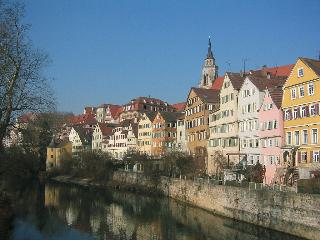

Below you can see a reconstruction of examples provided in the original paper.

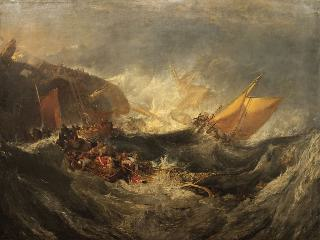
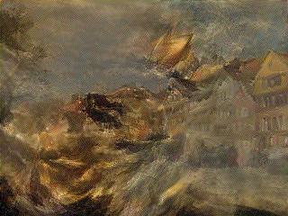

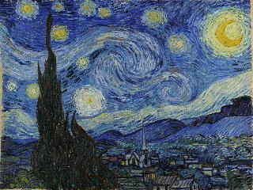
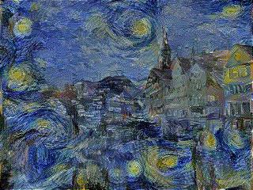

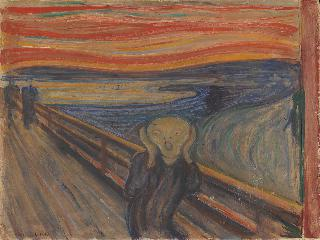
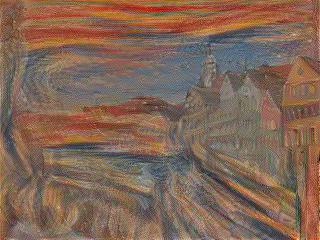

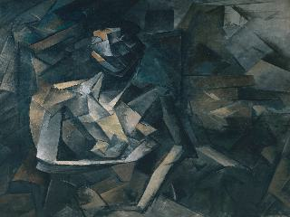
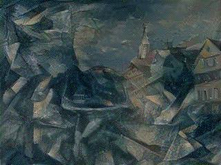

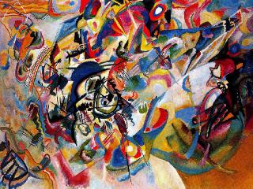
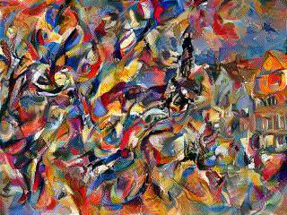

### Running the scripts

If you are using conda, you can use `environment.yml` to recreate the environment that was used to develop code present in this repository.

Example usage of `neural_style_transfer.py`: `python3 neural_style_transfer.py --style-img-path images/style/The_Starry_Night_van_Gogh.jpg --content-img-path images/Tuebingen_Neckarfront.jpg --height 240 --width 320 --save-freq 100 --beta 6000000 --alpha 0.1 --lr 0.1 --resize-style-img`.

It is possible to try different parameters without the need to run `neural_style_transfer.py` multiple times. Simply run `grid_search.sh $PATH_TO_STYLE_IMG $PATH_TO_CONTENT_IMG` where `$PATH_TO_STYLE_IMG` is a path to the style image and `$PATH_TO_CONTENT_IMG` is a path to the content image. Note that in order to avoid clutter you have to manually edit `grid_search.sh` in a highlighted place to adjust the parameters that you want to try.
